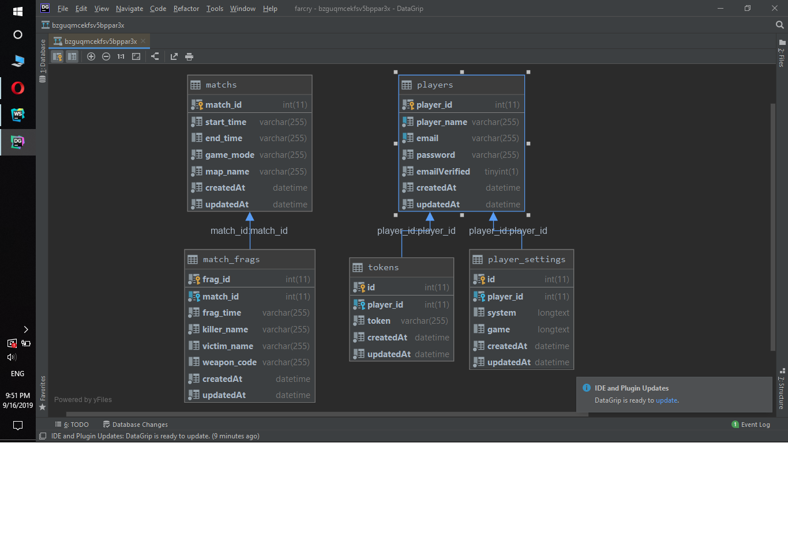

# Watch Dog
- Code in script folder
- Install module watch dog: **pip3 install watchdog**
- Install module requests : **pip3 install requests**

# Launcher
- How to run
    - The first way
        - Open Source folder
        - Install package : **npm install**
        - Run react script : **npm start**
        - Run launcher : **npm run-script run**
    - The second way
        - Open Build folder
        - Install package : **npm install**
        - Install electron global : **npm install -g electron**
        - Run : **npm run-script run**

# Restful API
- The API use mySQL
- Install package : **npm install**
- Run API : **npm start**
- Modify file .env:
    - Open file .env in rest-api folder
    - Follow https://medium.com/@pablo127/google-api-authentication-with-oauth-2-on-the-example-of-gmail-a103c897fd98
    - Fill all fields in .env by your information and info of DB

# ERP models
- 

# Document API
- https://app.swaggerhub.com/apis/matrix63/your-api/1.0.0-oas3

# Launcher packager
- Link download : https://drive.google.com/file/d/184LVDufjnSng5pOYxRqZqyvrQZFS2ahn/view?usp=sharing